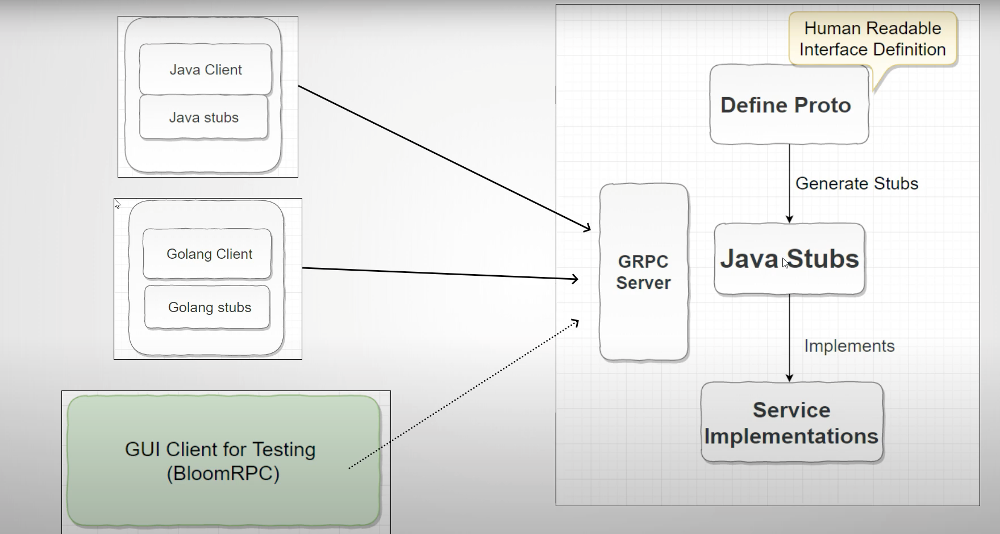

# gRPC Client

# Big Picture



## How to Set up

you will need to execute below steps,it will pick default goal at maven 

1. ```mvn ```
2. go to com.bain.gprc.client and run main method


## What is Happening behind these command
 1. it compile the project and creates the stub client from user.proto
 2. user.proto is used to create service and client stubs
 3. main method at com.bain.gprc.client hit the login and logout service


## Proto Files
1. Files need to be shared with clients so that they can create stubs and call this service.
